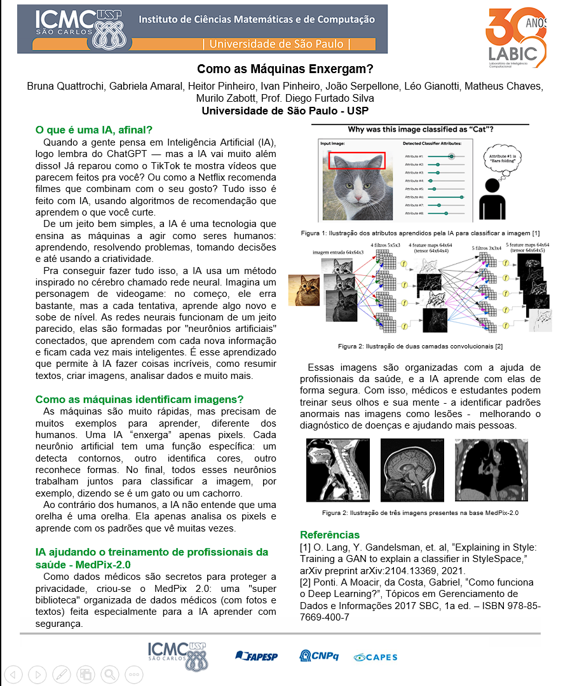

# SCC0270-redes-neurais

Repositório com os projetos da disciplina **SCC0270 - Redes Neurais e Aprendizado Profundo**, oferecida pelo ICMC - USP São Carlos, 2025.

## Configurando o projeto

Este projeto utiliza o gerenciador de ambientes e dependências [`uv`](https://github.com/astral-sh/uv).  
Para configurar o ambiente corretamente, siga os passos abaixo:

### 1. Instale o `uv`

Se ainda não tiver o `uv` instalado, execute:

```bash
curl -Ls https://astral.sh/uv/install.sh | bash
```

### 2. Crie e sincronize o ambiente virtual

Para criar um ambiente virtual e instalar todas as dependências listadas no `pyproject.toml`, execute:

```bash
uv sync
```

Este comando cria automaticamente o ambiente virtual e instala as bibliotecas necessárias.

---

## Projetos

### Projeto 01

- **Prazo:** 26/06/2025

O objetivo do Projeto 01 é construir um classificador binário capaz de classificar as imagens como `CT` (Tomografia Computadorizada) ou `MR` (Ressonância Magnética).  

De início, no notebook `Trabalho_01_ML.ipynb` foram construídos modelos de ML clássicos baseados em técnicas de extração de características como Descritores de Texturas e Cores e em seguida, ajustou-se um KNN. No notebook presente no Colab no seguinte [Notebook com treino da CNN no Colab](https://drive.google.com/drive/folders/1nnpJwP1hIiqQjFYWDabOCFGvpeqj7dPg?usp=drive_link) fez-se o fine-tuning de uma ResNet50 no dataset de treino e as predições e as métricas de avaliação foram computadas no notebook  `Trabalho_01_CNN.ipynb`.

Obtivemos os seguintes resultados na tarefa de classificação binária:

## Resultados Classificação da Modalidade

### KNN + Descritores de Textura

| Class        | Precision | Recall | F1-Score | Support |
|--------------|-----------|--------|----------|---------|
| MR           | 0.00      | 0.00   | 0.00     | 100     |
| CT           | 0.50      | 1.00   | 0.67     | 100     |
| **Accuracy** |           |        | 0.50     | 200     |
| **Macro Avg**| 0.25      | 0.50   | 0.33     | 200     |
| **Weighted Avg** | 0.25  | 0.50   | 0.33     | 200     |


### KNN + Descritores de Imagem

| Class          | Precision | Recall | F1-Score | Support |
|----------------|-----------|--------|----------|---------|
| MR             | 0.60      | 0.64   | 0.62     | 100     |
| CT             | 0.62      | 0.58   | 0.60     | 100     |
| **Accuracy**   |           |        | 0.61     | 200     |
| **Macro Avg**  | 0.61      | 0.61   | 0.61     | 200     |
| **Weighted Avg**| 0.61     | 0.61   | 0.61     | 200     |


### KNN + Descritores de Textura + Imagem

| Class           | Precision | Recall | F1-Score | Support |
|-----------------|-----------|--------|----------|---------|
| MR               | 0.00      | 0.00   | 0.00     | 100     |
| CT               | 0.50      | 1.00   | 0.67     | 100     |
| **Accuracy**     |           |        | 0.50     | 200     |
| **Macro Avg**    | 0.25      | 0.50   | 0.33     | 200     |
| **Weighted Avg** | 0.25      | 0.50   | 0.33     | 200     |

### Fine-tuning ResNet50 (02 epochs) 

| Class           | Precision | Recall | F1-Score | Support |
|-----------------|-----------|--------|----------|---------|
| MR               | 0.99      | 0.98   | 0.98     | 100     |
| CT               | 0.98      | 0.99   | 0.99     | 100     |
| **Accuracy**     |           |        | 0.98     | 200     |
| **Macro Avg**    | 0.99      | 0.98   | 0.98     | 200     |
| **Weighted Avg** | 0.99      | 0.98   | 0.98     | 200     |

## Resultados Classificação da Localidade 

Métodos de ML com descritores de textura e cores não foram capazes de classificar a Localidade das imagens. 
Foi treinado, do mesmo modo, uma ResNet50 para a classificação das 21 localidades. 

| Label                  | Precision | Recall | F1-Score | Support |
|------------------------|-----------|--------|----------|---------|
| Chest, Pulmonary       | 0.00      | 0.00   | 0.00     | 1       |
| Genitourinary          | 0.68      | 0.94   | 0.79     | 51      |
| Head and Neck          | 0.00      | 0.00   | 0.00     | 4       |
| Cardiovascular         | 0.00      | 0.00   | 0.00     | 1       |
| Brain and Neuro        | 0.70      | 0.88   | 0.78     | 24      |
| Eye and Orbit          | 1.00      | 0.29   | 0.44     | 7       |
| Gastrointestinal       | 0.75      | 0.29   | 0.42     | 31      |
| Vascular               | 0.00      | 0.00   | 0.00     | 10      |
| Pathology              | 0.18      | 0.27   | 0.21     | 11      |
| Spine                  | 0.43      | 0.30   | 0.35     | 10      |
| Endocrine              | 0.48      | 0.71   | 0.57     | 14      |
| Nerve, central         | 0.00      | 0.00   | 0.00     | 4       |
| Musculoskeletal        | 0.82      | 0.69   | 0.75     | 26      |
| Abdomen                | 0.00      | 0.00   | 0.00     | 6       |
| **Accuracy**           |           |        | **0.57** | 200     |
| **Macro Avg**          | 0.36      | 0.31   | 0.31     | 200     |
| **Weighted Avg**       | 0.58      | 0.57   | 0.54     | 200     |

Obtivemos uma acurácia de 57% que é ligeiramente superior à reportada pelos autores de 52.5%.  
Como nem todas as classes estão presentes no conjunto de teste, a tabela acima não apresenta todas as classes. 
Percebe-se que as Localidades com menores exemplos no conjunto de treinamento apresentam menores valores de acurácia, o que é o esperado. 
Não observamos melhoras significativas com o aumento do númeto de epochs acima de 2. 
---

### Projeto 02

- **Prazo:** 07/07/2025

(Descrição será adicionada em breve.)

---

### Projeto 03

- **Prazo:** 11/06/2025

O projeto 03 refere-se à atividade extensionista que foi apresentada no dia, 11/6 no campus da USP - São Carlos no ICMC. 
Apresentou-se o poster intitulado **Como as máquinas enxergam?** que pode ser acessado na pasta: `posters/Poster Rede Neurais - Final.pptx`



